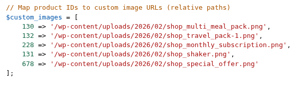
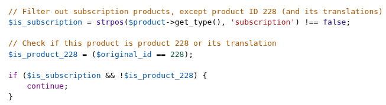
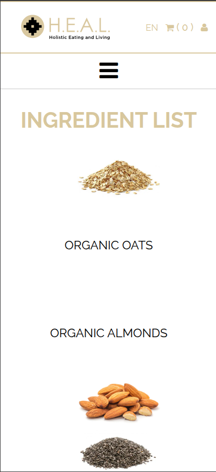
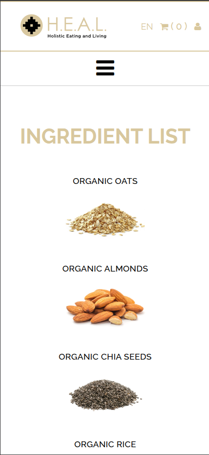
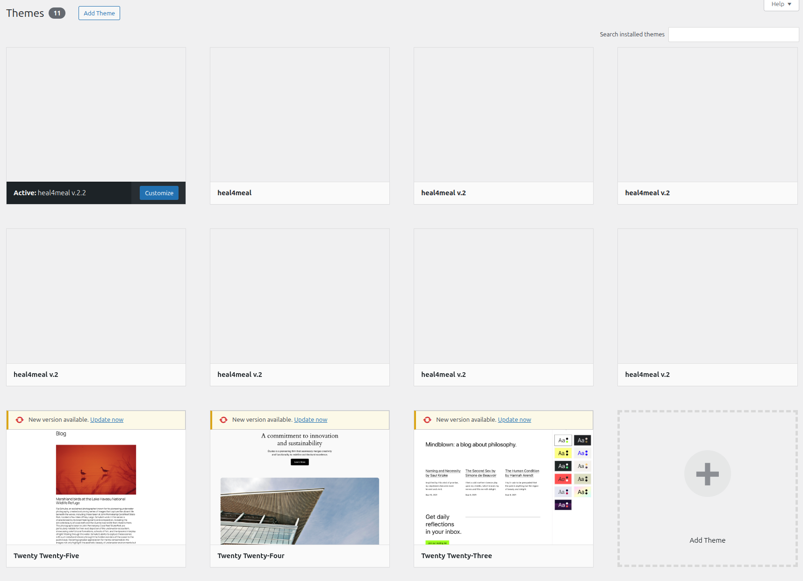
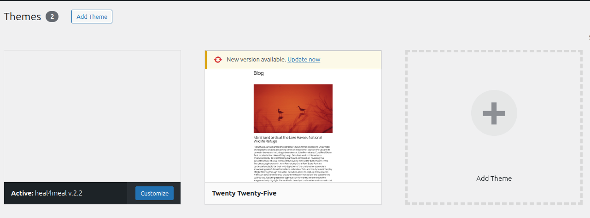

# Cleanup & Refactor - Heal4Meal

## Image optimization across the entire media library

Every product photo, banner, and uploaded image on the site has been converted from older formats (`.jpg`, `.jpeg`, `.png`) to the modern `.webp` format, which is now the de-facto standard across the site.

Previously, the site relied on the **WebP Express** plugin, which generated and served WebP versions of every image on the fly while keeping the original `.jpg`/`.jpeg`/`.png` files on disk as the source of truth. Visitors were already receiving WebP imagery. The plugin just maintained two copies of every image behind the scenes. We have now made WebP the actual format on disk, removed the originals, and updated every reference accordingly.

**Why it matters**
- Page load and content delivery for visitors remain the same as before. They were already being served WebP via the plugin.
- The benefit is on the server side: roughly half the image storage footprint, simpler backups, and one fewer plugin layer between the request and the file.

**Conversion quality**
- PNG: **lossless** (no information loss whatsoever).
- JPG / JPEG: **quality 85**

---

## Single source of truth for product content

Products are now the single source of truth. Every component that displays a product reads its content directly from the product, instead of carrying its own copy. This includes Shop page rows, the Shop dropdown menu in the main navigation, and related areas.

As part of this, we removed code that relied on hardcoded product IDs, hardcoded strings, and hardcoded translations.

<table><tr><td><strong>Example 1</strong> </td><td><strong>Example 2</strong> </td></tr></table>

*And many more...*

**Benefits**
- Dead code removed across the theme.
- Adding, editing, or removing a product is now a single, predictable action. Change it on the product and every component updates automatically.

---

## Navigation improvements

- **Auto-scroll to product:** clicking a product in the Shop dropdown now scrolls directly to that product's expanded description on the Shop page, instead of landing at the top. (The subscription still links to its own dedicated page.)
- **Mobile menu closes on selection:** the mobile menu now closes automatically after tapping any link. Previously it stayed open over the destination, which was especially disorienting for the scroll-based product links. Also fixes a JavaScript error that occurred when tapping the in-menu close button.
- **Mobile menu dismisses on resize to desktop:** if the mobile menu was open and the viewport grew to desktop width (tablets, rotating devices), the menu now closes itself automatically instead of overlapping the desktop layout.

---

## Single product page responsiveness

**Existing problems**
- Layout on screens narrower than 1000px was not fluid; it rendered correctly on initial page load, but any subsequent window resize broke the layout.
- Content overflowed horizontally rather than adapting to the available width.

**Improvements**
- Replaced the legacy float-based layout with a modern flexbox approach.
- Window resizing is now handled correctly; content fluidly matches the screen width at any size.

---

## Ingredients list, redone from scratch

**Problems with the previous implementation**
- Different images shown for some ingredients depending on the language.
- Some ingredients were missing entirely on certain language versions.
- Poor alignment and inconsistent spacing on mobile.

**What changed**
- Ingredients are now a custom post type; each ingredient is a single entry in the WordPress admin, shared across all languages.
- A new Advanced Custom Fields component reads and renders all published ingredients with one consistent layout.
- CSS was optimized for both desktop and mobile.

**Result:** 4 uniform, responsive pages with no discrepancies across languages.

<table><tr><td><strong>Before</strong> </td><td><strong>After</strong> </td></tr></table>

---

## Removal of the Czech language

The Czech (cs) translation had already been disabled. We removed the remaining references to it in both code and content (menus, page templates, product fields, the language switcher).

About 73 historical orders still carry stale Czech metadata, but this is harmless. It does not affect the customer-facing experience or order processing, and it preserves the historical record of those orders.

---

## Refactor of `functions.php`

The theme's main `functions.php` file, which had grown organically over several years, was refactored end to end. All existing functionality is preserved exactly. What changed is how the file is structured.

**What changed**
- The file is now divided into clearly numbered sections (constants, theme setup, asset registration, WooCommerce integration, AJAX endpoints, helpers, and so on), so any function can be located at a glance.
- Every function carries a short docblock explaining what it does and what it returns, making future maintenance significantly easier.
- Related logic is grouped together rather than scattered, and obviously dead branches were removed in the process.

**Visible effect:** none on the public site. This is a maintainability win: future fixes, additions, or audits on the theme can be carried out faster and with less risk of unintended side effects.

---

## Removed unused themes and plugins

A round of housekeeping removed dead weight from the WordPress install.

**Themes (9 removed)**
- The default WordPress themes for 2023 and 2024, which were never in use.
- Seven archived earlier versions of the Heal4Meal theme.

Before:

After:

**Plugins removed (15):**
- **UpdraftPlus**: had accumulated over 2 GB of stale local backups on the server while serving no active purpose; removed.
- **All-in-One WP Migration Unlimited Extension**.
- **WP Sync DB** and **WP Sync DB Media Files**.
- **W3 Total Cache**.
- **Speed Optimizer**.
- **WebP Express**.
- **Contact Form 7** and **Contact Form 7 Multilingual**.
- **WP Activity Log**.
- **WP Activity Log for WooCommerce**.
- **AddToAny Share Buttons**.
- **Media File Sizes**.
- **Solid Security Basic**.
- **WP File Manager**.

**Plugins added (1):**
- **Safe SVG**.

---

## Total website size: reduced from 5.5 GB to 1 GB

---

## Pages missing content on the production website

The following pages are missing content on the production website:

- https://heal4meal.com/the-antioxidant-benefits-of-goji-berries/
- https://heal4meal.com/how-can-chia-seeds-be-a-good-help-with-weight-loss/
- https://heal4meal.com/the-benefits-of-blueberries/
- https://heal4meal.com/the-benefits-of-parsley/
- https://heal4meal.com/how-can-coconut-help-regulate-your-metabolism/
- https://heal4meal.com/the-benefits-of-blackberries/
- https://heal4meal.com/the-benefits-of-rice/

---

## Testing

All changes have been tested across the following browsers and platforms:

- Chrome (Windows, Android)
- Firefox (Windows)
- Safari (macOS, iOS)

All features used are globally supported, with a browser coverage score of 95%+ on caniuse.com.

**WooCommerce checkout** has been tested end-to-end in test mode using Stripe's [dummy test cards](https://docs.stripe.com/testing). Both one-time orders and subscriptions were verified successfully.

---

## Migration strategy

To preserve existing WooCommerce subscriptions and orders, the migration will follow these steps:

1. Wait for off-peak hours.
2. Take a full backup of the original production site.
3. Export the WooCommerce data separately using a tested script.
4. Import the staging site using the All-in-One WP Migration plugin, which will temporarily override all production data.
5. Once the import is complete, re-import the original production WooCommerce data into the new production site.

---

## TBD: post production migration

The following plugins will be added once the website migrates onto the production domain:

- SMTP setup
- Google Tag Manager
- LiteSpeed Cache
- WordFence
